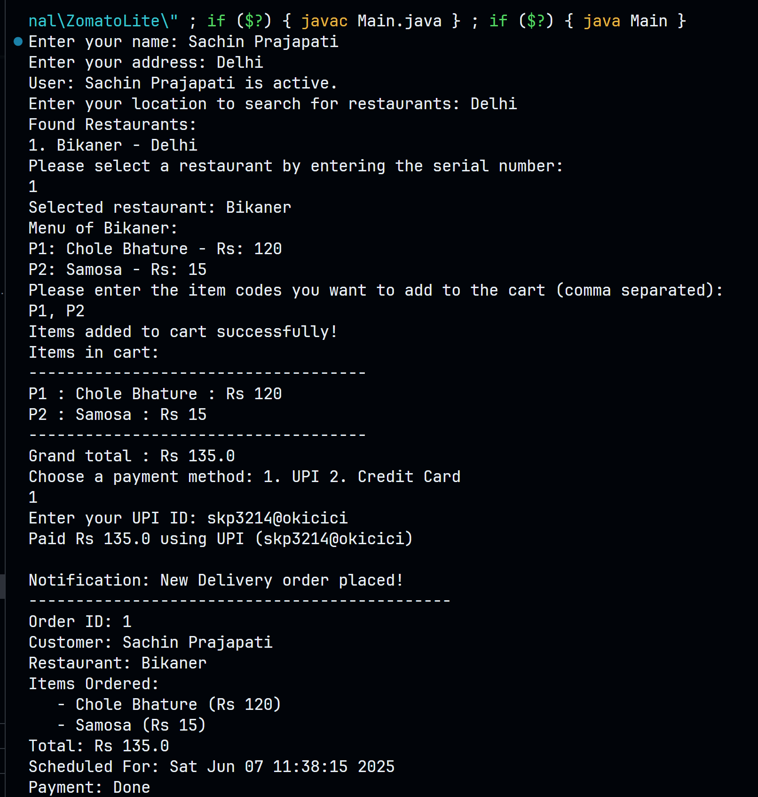

# ZomatoLite - Low-Level Design (LLD) Project 🍔🚀

## Overview 📋
This project outlines the low-level design (LLD) of **ZomatoLite**, a simplified food delivery application. It focuses on core functionalities like user management, restaurant and menu browsing, cart handling, order processing, payment strategies, and notifications. 📦🍕

## System Design 🖼️

### Key Classes and Relationships 📐
- **User** 👤: Represents a user with attributes like `userId`, `name`, `address`, and a `cart`. Users interact with the system to browse restaurants, add items to their cart, and place orders.
- **Cart** 🛒: Manages a user's cart, linked to a `Restaurant`, containing a list of `MenuItem` objects. Provides methods like `addToCart`, `totalCost`, and `isEmpty`.
- **Restaurant** 🏪: Contains details like `restaurantId`, `name`, `location`, and a `menu` (list of `MenuItem`). Managed by `RestaurantManager` (Singleton).
- **MenuItem** 🍴: Represents a menu item with `code`, `name`, `price`, and `category`.
- **Order** 📜: Represents an order with `id`, `user`, `restaurant`, items, and a `paymentStrategy`. Managed by `OrderManager` (Singleton), which handles `addOrder` and `getOrder`.
- **IOrderFactory** 🏭: Interface to create orders (`createOrder` method), implemented by `NormalOrderFactory`.
- **Payment Strategies (IPaymentStrategy)** 💳: Interface for payment methods (`pay` method), implemented by `CreditCardPaymentStrategy` and `UpiPaymentStrategy`.
- **Order Scheduling** 📅: `ScheduleOrderFactory` creates `DeliveryOrder` or `PickupOrder` with attributes like `address` and `getType`.
- **NotificationService** 📢: Handles notifications for orders (`order_order`, `notifyUser`).

### Design Patterns Used 🛠️
- **Singleton** 🔒: Applied to `RestaurantManager` and `OrderManager` to ensure a single instance manages restaurants and orders.
- **Factory Pattern** 🏭: `IOrderFactory` and `ScheduleOrderFactory` for creating orders and scheduling deliveries/pickups.
- **Strategy Pattern** 🎯: `IPaymentStrategy` for handling different payment methods (UPI, Credit Card).

## How It Works ⚙️
1. **User Interaction** 👤: A user provides their `name` and `address`, then searches for restaurants by `location` (e.g., Delhi, Kolkata, Chennai). 🌍
2. **Restaurant Selection** 🏪: The system displays available restaurants, and the user selects one by entering a serial number. ✅
3. **Menu Browsing** 🍴: The user views the selected restaurant's `menu` and adds items to their `cart` using item `code`s. 🛒
4. **Checkout** 🛍️: The user chooses a payment method (UPI or Credit Card), provides payment details, and places the order. 💳
5. **Order Scheduling** 📅: The `ScheduleOrderFactory` schedules the order as a `DeliveryOrder` or `PickupOrder`. 🚚
6. **Payment and Notification** 📢: The user pays via the selected `paymentStrategy`, and `NotificationService` sends updates about the order status. 🔔

## Future Enhancements 🚀
- Add support for multiple restaurants per order. 🍽️
- Implement real-time tracking for deliveries. 📍
- Extend payment options with wallet or cash-on-delivery. 💸
- Add validation for user inputs like item codes and payment details. ✅

## Setup and Execution 🏃
This project includes a `Main` class to simulate the happy flow:
1. Run the `Main` class to start the ZomatoLite simulation. ▶️
2. Follow the prompts to enter user details, search for restaurants, select a restaurant, add items to the cart, choose a payment method, and place the order. 📝
3. The system currently supports predefined locations (Delhi, Kolkata, Chennai) and payment methods (UPI, Credit Card). 🌆

