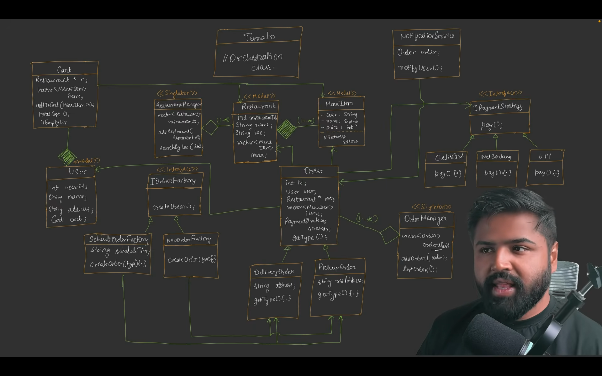
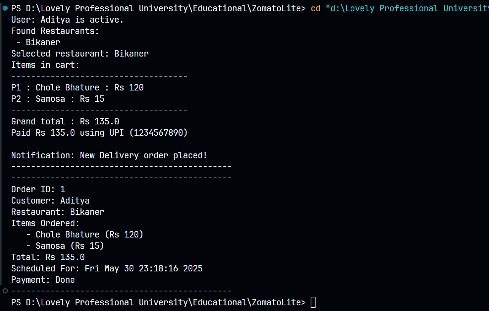

# Food Delivery App - Low-Level Design (LLD)

## Overview
This project outlines the low-level design of a food delivery application, focusing on the core components such as user management, cart handling, restaurant and menu management, order processing, payment strategies, and order scheduling/delivery.

## System Design

### Key Classes and Relationships
- **User**: Represents a user with attributes like `userId`, `name`, `address`, and a `cart`. Users can create orders via the `IOrderFactory`.
- **Cart**: Manages a user's cart, linked to a restaurant (`Restaurant* r`), containing a list of `MenuItem` objects (`vector<MenuItem> items`). Provides methods like `addToCart`, `totalCost`, and `isEmpty`.
- **Restaurant**: Contains details like `restaurantId`, `name`, `location`, and a `menu` (list of `MenuItem`). Managed by `RestaurantManager` (Singleton).
- **MenuItem**: Represents a menu item with `name`, `price`, and `category`.
- **Order**: Represents an order with `id`, `user`, `restaurant`, items, and a `paymentStrategy`. Managed by `OrderManager` (Singleton), which handles `addOrder` and `getOrder`.
- **OrderFactory**: Interface to create orders (`createOrder` method), implemented by `NormalOrderFactory`.
- **Payment Strategies (IPaymentStrategy)**: Interface for payment methods (`pay` method), implemented by `CreditCard`, `NetBanking`, and `UPI`.
- **Order Scheduling**: `ScheduleOrderFactory` creates `DeliveryOrder` or `PickupOrder` with attributes like `address` and `getType`.
- **NotificationService**: Handles notifications for orders (`order_order`, `notifyUser`).

### Design Patterns Used
- **Singleton**: Applied to `RestaurantManager` and `OrderManager` to ensure a single instance manages restaurants and orders.
- **Factory Pattern**: `OrderFactory` and `ScheduleOrderFactory` for creating orders and scheduling deliveries/pickups.
- **Strategy Pattern**: `PaymentStrategy` for handling different payment methods.

## How It Works
1. **User Interaction**: A user adds items to their `Cart` from a `Restaurant`'s `menu`.
2. **Order Creation**: The `OrderFactory` creates an `Order` with the user's cart items.
3. **Payment**: The user selects a payment method (`CreditCard`, `NetBanking`, or `UPI`) via `PaymentStrategy`.
4. **Order Scheduling**: `ScheduleOrderFactory` schedules the order as a `DeliveryOrder` or `PickupOrder`.
5. **Notification**: `NotificationService` sends updates about the order status.

## Future Enhancements
- Add support for multiple restaurants per order.
- Implement real-time tracking for deliveries.
- Extend payment options with wallet or cash-on-delivery.

